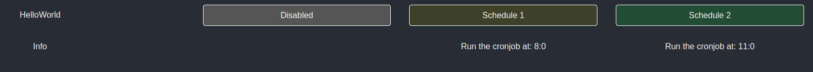
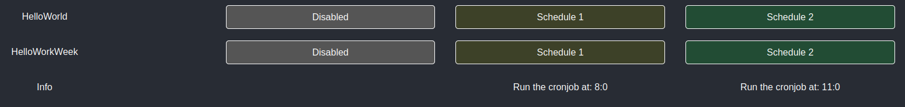
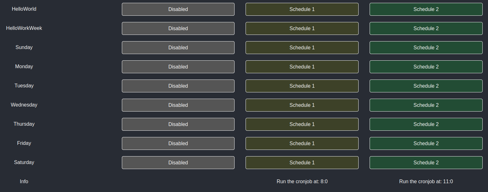

# Lights UI
A simple one-page Flask application for controlling cronjobs.

**Note!** This is only intended for local use; it is not suitable or safe to use in a production environment or 
expose it to the internet without implementing proper security measures.

Provides a job view with three options to run the cronjob at Schedule 1, Schedule 2 or not at all. 
You can mix and match the jobs as shown in the [examples](#examples).

Supports as many cronjobs as necessary, provided they follow the correct structure.

# Article
I wrote an article about why and how I created this project, you can read it [here](https://mituuz.com/content/crontab_python_ui.html).

# Quick start
1. Clone the repository
    ```bash
    git clone https://github.com/MituuZ/lights-ui.git
    cd lights-ui
    ```
2. Create a virtual environment
   ```bash
   python3 -m venv venv
   source venv/bin/activate
   ```
3. Install dependencies
   ```bash
   pip install -r requirements.txt
   ```
4. Copy configurations
    ```bash
    cp config_example.py config.py
    ```
5. Set up config.py
    - user
    - script identifier
6. Run the application
    ```bash
    python3 app.py
    ```
7. Access the UI
    - Open your browser and go to http://localhost:5000.

# Configuring the project
To start, you should copy the config_example.py and save it as config.py, this allows you to configure your setup,
without changing any git tracked files.

## Required configurations
### User
You need to give the correct user that has the cronjob defined that you want to control. (most likely your own username)

### The cronjob
**Note!** To work correctly, the cronjob's name (the comment above the actual declaration) must be a single "word".
e.g. it shouldn't contain spaces

You can add as many cronjobs as you want, but each of them should match the [script identifier](#script-identifier).

#### Examples
For these examples the script identifier is `hello`.

The actual crontabs look like this after all the examples:
```
# HelloWorld
0 5 * * * echo hello > ~/hello.txt
# HelloWorkWeek
0 5 * * 1-5 echo hello > ~/hello.txt
# Sunday
0 5 * * 0 echo hello > ~/hello.txt
# Monday
0 5 * * 1 echo hello > ~/hello.txt
# Tuesday
0 5 * * 2 echo hello > ~/hello.txt
# Wednesday
0 5 * * 3 echo hello > ~/hello.txt
# Thursday
0 5 * * 4 echo hello > ~/hello.txt
# Friday
0 5 * * 5 echo hello > ~/hello.txt
# Saturday
0 5 * * 6 echo hello > ~/hello.txt
```

##### Add a job that runs every day.
```bash
(crontab -l ; echo "# HelloWorld"; echo "0 5 * * * echo hello > ~/hello.txt") | crontab -
```



##### Add a job that runs from monday to friday
```bash
(crontab -l ; echo "# HelloWorkWeek"; echo "0 5 * * 1-5 echo hello > ~/hello.txt") | crontab -
```



##### Add a separate job for each day
```bash
(crontab -l ; echo "# Sunday"; echo "0 5 * * 0 echo hello > ~/hello.txt") | crontab -
(crontab -l ; echo "# Monday"; echo "0 5 * * 1 echo hello > ~/hello.txt") | crontab -
(crontab -l ; echo "# Tuesday"; echo "0 5 * * 2 echo hello > ~/hello.txt") | crontab -
(crontab -l ; echo "# Wednesday"; echo "0 5 * * 3 echo hello > ~/hello.txt") | crontab -
(crontab -l ; echo "# Thursday"; echo "0 5 * * 4 echo hello > ~/hello.txt") | crontab -
(crontab -l ; echo "# Friday"; echo "0 5 * * 5 echo hello > ~/hello.txt") | crontab -
(crontab -l ; echo "# Saturday"; echo "0 5 * * 6 echo hello > ~/hello.txt") | crontab -
```



### Script identifier
To show the correct jobs in the UI, the command of the job must match this line. 
This is used to fetch and modify the cronjob information.

# Running the project
Requires:
- Python 3
- [Some configurations](#required-configurations)

## Using venv
If you've already created a venv, you can jump to [activating the virtual environment](#activating-the-virtual-environment).

Or if you don't want to use env, you can jump to [installing requirements.txt](#installing-requirementstxt).

### Creating a virtual environment
To use a venv for the project, we first need to create it, if it doesn't exist. This creates a venv folder
to the project root.
```bash
python3 -m venv ./venv
```

### Activating the virtual environment
Assuming you're using bash, you can activate the virtual environment with the following command.
```bash
source ./venv/bin/activate
```

## Installing requirements.txt
To install the required dependencies, you'll need to install them using pip.

```bash
pip install -r requirements.txt
```

## Starting the ui
Mostly for testing, blocks the current shell.
```bash
python3 app.py
```

Start the ui in the background and keep it running even after the shell session is closed.
```bash
nohup python3 app.py &
```

# Flask
Flask is a lightweight WSGI web application framework. It is designed to make getting started quick and easy, with the ability to scale up to complex applications.

Website: https://palletsprojects.com/p/flask/
License: BSD-3-Clause
Copyright: 2010 by Pallets

BSD-3-Clause License:  
Copyright 2010 Pallets

Redistribution and use in source and binary forms, with or without modification, are permitted provided that the following conditions are met:

1. Redistributions of source code must retain the above copyright notice, this list of conditions and the following disclaimer.
2. Redistributions in binary form must reproduce the above copyright notice, this list of conditions and the following disclaimer in the documentation and/or other materials provided with the distribution.
3. Neither the name of the copyright holder nor the names of its contributors may be used to endorse or promote products derived from this software without specific prior written permission.

THIS SOFTWARE IS PROVIDED BY THE COPYRIGHT HOLDERS AND CONTRIBUTORS "AS IS" AND ANY EXPRESS OR IMPLIED WARRANTIES, INCLUDING, BUT NOT LIMITED TO, THE IMPLIED WARRANTIES OF MERCHANTABILITY AND FITNESS FOR A PARTICULAR PURPOSE ARE DISCLAIMED. IN NO EVENT SHALL THE COPYRIGHT HOLDER OR CONTRIBUTORS BE LIABLE FOR ANY DIRECT, INDIRECT, INCIDENTAL, SPECIAL, EXEMPLARY, OR CONSEQUENTIAL DAMAGES (INCLUDING, BUT NOT LIMITED TO, PROCUREMENT OF SUBSTITUTE GOODS OR SERVICES; LOSS OF USE, DATA, OR PROFITS; OR BUSINESS INTERRUPTION) HOWEVER CAUSED AND ON ANY THEORY OF LIABILITY, WHETHER IN CONTRACT, STRICT LIABILITY, OR TORT (INCLUDING NEGLIGENCE OR OTHERWISE) ARISING IN ANY WAY OUT OF THE USE OF THIS SOFTWARE, EVEN IF ADVISED OF THE POSSIBILITY OF SUCH DAMAGE.
